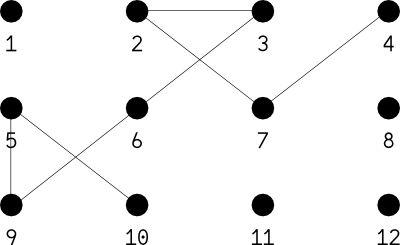
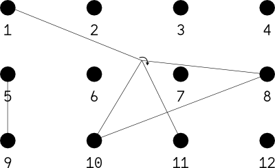

# 1962 Instructions

## Architecture and files

The project contains:

- README
- INSTRUCTIONS.md
- CONTRIBUTORS
- PIECE
- /media
- /extra

### README.md

Summary of the project used for the GitHub project homepage and the project website. This file follows the [Markdown](http://en.wikipedia.org/wiki/Markdown) syntax.

### INSTRUCTIONS.md

The file you are reading now. It explains the project and how to participate. This file follows the [Markdown](http://daringfireball.net/projects/markdown/syntax) syntax.

### CONTRIBUTORS

List of the contributors to the project. To write / edit this file, see *Syntax*.

### PIECE

Source code of the physical sculpture 1962. In this file are depicted and documented all the objects which constitute a sculpture version and all the informations about the sculpture version itself.

### media/

Folder: Contains images of the current state of the piece and archives of past versions. This folder must be updated at least with photographs of the sculpture for each versions.

In /media, documents must be named using the tag of the last commit. For example: 0.jpg will be a photograph of the version 0 of 1962 ; 2_5.ogg can be a video capture of the version 2.5 of 1962…

A /media/HD (optional) subfolder can contain high-definition documents. This folder will be used to make media loading easier on a project web page. In this folder, documents must be named using the tag of the last commit + "HD". For example: 0_3HD.jpg.

### extra/

Folder (optional): It can be used as an addenda, an annex or the archive of complementary documents such as process pictures, drawings films…

## Main syntax

1962's files CONTRIBUTORS and PIECE follow a couple of simple syntactic rules:

### Basics

- Use the format "Key: value"
- Parenthood relationship are symbolized using indentation (hit [tab](http://en.wikipedia.org/wiki/Tab_character) key at the beginning of a line). Demonstration:

        Name: Floral foam brick
        Size
            Width: 22,5cm
            Height: 10,6cm
            Depth: 8cm

- A line can't stay empty
- A line must begin with a capital letter
- A line can contain a title or a couple "key: value"

### Main informations and example

Details to understand the PIECE file:

    *     = Required informations
    //    = Comments
    Text: = Needs a value
    Text  = Is a title

The PIECE file template:

    Title: 1962
        Project curator: * // Name of the owner of the project
        Version: * // The version number
        Repository URL: * // Ex.: https://github.com/raphaelbastide/1962
        Physical location
            Latitude: *
            Longitude: *
            Altitude:
            City:
            Country: *
        Sculpture size 
            Width: *
            Height: *
            Depth:
        Position of the origin: * // Free description of a point. Each object's position will be relative to this point
        Capture hardware
            Type: // Can be photographic, video, video stream, drawing, 3D capture…
            Model: // free description
            X position: // Relative to the given origin
            Y position:
            Z position:
            Dirrection: // Can be a free description or more precise
        Lighting hardware
            Natural // or, if artificial:
            X position: // Relative to the given origin
            Y position:
            Z position:
            Dirrection: // Can be a free description or more precise
        Objects *
            ID: * // Define the identifier for the object - First one must be 1, then 2, 3…
                Name: * // A name of the object
                Size
                    Width: *
                    Height: *
                    Depth: *
                Position
                    X position: * // Relative to the given origin
                    Y position: *
                    Z position: *
                    Position description: // Free description of the position
                Color / texture:
            ID: 2 // Here can begin a second object description
                Name: 
                ...
                
## Evolutions of this INSTRUCTIONS file

This INSTRUCTIONS file can and must evolve. I should be modified in order to accompany the PIECE file. For example if a new kind of object needs the creation of a new kind of key (pstringrty), it needs to be archived below:

### Mode

Electric or mechanical hardware can have one or multiple status, in this case a key "Mode" will be specified with values such as "On", "Off", "Blink"…

    Mode: On

### Nutrients

Plant or animals needs water or food to live, a key "Additional water" or "Additional food" can be created, with scalable values such as units "|". Example for four water additions:

    Additional water: ||||

### Circular objects

It should have a "Diameter" instead of a "Width".

### Cordlike objects

Some objects like thread, cord, string, string and strap can be assimilated as long and flexible. If tight, they can be described as links between located points just like segments in space:

    Position
        X1 position: 2.27m
        Y1 position: 0
        Z1 position: 0.68m
        X2 position: 3.47m
        Y2 position: 1.65m
        Z2 position: 0.54m
        X3 position: 2.8m
        Y3 position: 1.65m
        Z3 position: 0
        Position description: Flexible cordlike object, nailed following XYZ1, XYZ2, XYZ3

### Object origins

Default object origins are usually defined by object's closest angle to the main origin at the moment of its first representation on the sculpture. It can be confusing for some objects, in this case, it is better to precise the object origin in the "Position description" key:

    Position description: Vertical, origin is the bottom center of the stick

### Models

An object can be considered as a copy of another model object or a [group of objects](#groups). Consequently, it will inherit by default of the keys and values of its model. Models will be quoted with, as a key: "Model" and as a value: the model object's ID. In the following example, the object (ID=6) will inherit the size and Y and Z positions of its model (ID=5).

    ID: 5
        Name: Credit card
        Size
            Width: 8,5cm
            Height: 5,5cm
            Depth: 0.1cm
        Position
            X position: 3cm
            Y position: 3cm
            Z position: 0cm
    ID: 6
        Model: ID=5
        Possition
            X position: 10cm

If an object is relative to a model from a previous sculpture version, the version number should be added before the model's ID separated by a slash:

    ID: 6
        Model: v0.7 / ID=5
        Possition
            X position: 10cm

### Importation

A whole version can be imported to another version, in this case, all the object of the imported version will be included with their respective characteristics (size, position…). In the following example, v0.3 will be imported into v0.8:

    Title: 1962
        Project curator: Raphaël Bastide
        Version: 0.8
        …
        Import: v0.3
        Objects
            ID: 10
            …

### Relative values

A value can be relative to another object's value. The two objects must be copies of the same model. An operator (+, -, *) will be used before the relative value to change it, depending to the previous declared object. In the following example, the resulting X position of object (ID=2) will be set at 7cm:

    ID: 4
        Position
            X position: 5px
    ID: 5
        Model: ID=4
        Position
            X position: +2px

### Groups

A group of objects can be declared to be used as [model](#models). In the following example, the group (ID=1) will include object (ID=2) and object (ID=3).

    ID: 1
        Group: ID=2, ID=3

Given that, the group (ID=1) can be duplicated and some of its implied pstringrties can be changed and be [relative](#relative-values) :

    ID: 4
        Model: ID=1
        Position
            Z position +10cm

### Révisables

This section concerns the project “Révisable 1” and 1962 v0.9. A special format is used to describe the strokes strings can trace in a grid space.

A grid is composed by points that can be connected by strings. Each point of a grid can hold extremities of strings, part of strings, or nothing.

- Grid points are always named using numbers from top to bottom and left to right, such as occidental writing
- Order of the connection does not have any importance in the code, the same composition can be coded in two different ways

#### Code format

    [C2][4:7:2:3:9:5:10][20/07/13]
     a          b           c

a: Choice of the string.
b: Declaration of the path of the rigging
c: Date of the intervention based on the format: [dd/mm/yy]

The code above will produce the following composition:

#### Advanced compositions

Several strings can be used in the same composition consequently, each path must be declared after a [string choice](#string-choice) `[C2][2:4:7]`.

Strings can criss-cross from the front and the bottom. A crossing should be declared unsing parenthesis and the signs `<` and `>` will specify id the crissing occur respectively from front to behind or from behind to front.

    [C2][1:8:10:(>1:8)11][C1][5:9][20/07/13]
     a      b      c      d    e      f

a: Choice of the first string
b: First string path
c: The segment 10:11 of the first string cross the segment 1:5 from behind to front
d: Choice of the second string
e: Second string path
f: Date of the intervention

The code above will produce the following composition:

#### String choice

- C1: 1m Black elastic - [image](media/extra/doc-media/black-elastic.png)
- C2: 3m Black elastic - [image](media/extra/doc-media/black-elastic.png)
- C3: 5m Black elastic - [image](media/extra/doc-media/black-elastic.png)
- C4: 2m Red velvet string barrier with chrome hooks - [image](media/extra/doc-media/velvet-rope.png)

#### Alternative writing

In order to facilitate the versionning, the code format can be writen with one statement per line.

    [C2][1:8:10:(>1:8)11][C1][5:9][20/07/13]

equals to:

    C2
    1
    8
    10
        >1:8
    11
    
    C1
    5
    9
    20/07/13
 